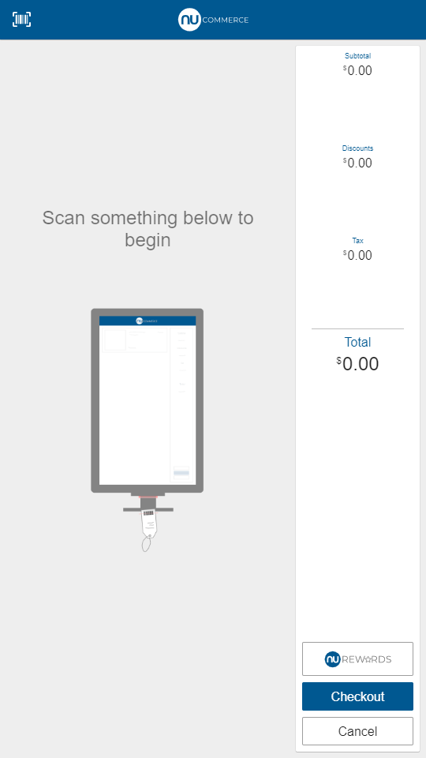
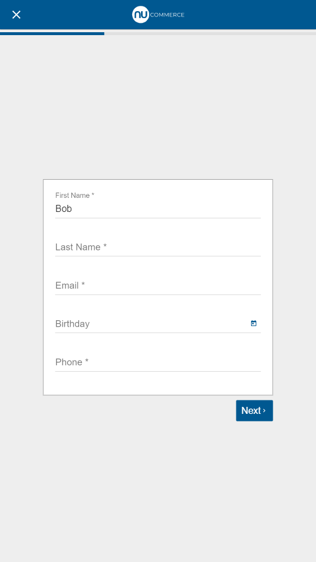
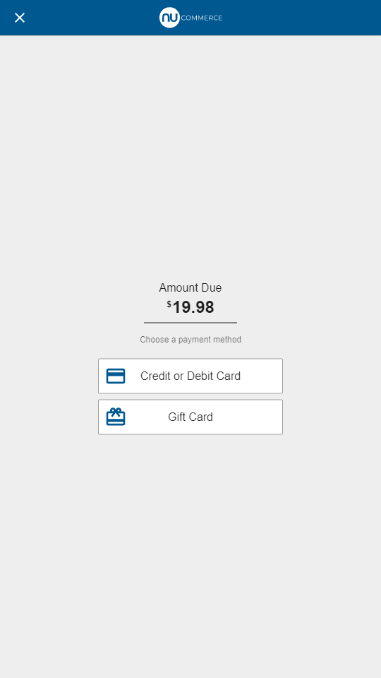

# Self Checkout

OpenPOS Self Checkout consists of several basic screen types that can be used for a simple self checkout flow. These screens share many common components such as buttons, inputs, images, etc.

These core screens can be modified slightly through basic theming, such as with colors, fonts, and sizing. In order to change significantly change screens, core components can be overridden or replaced entirely. Custom screens may also be implemented using the shared components.

## Screen Types

### Self Checkout Home

The [self checkout home screen](self-checkout-home.md) is a basic splash screen that the user taps to start the self checkout flow.  The splash screen image can be set dynamically, as well as the text and logos.

### Self Checkout Sale

The [self checkout sale screen](self-checkout-sale.md) covers the main functionality of the sale and is similar to the core sale screen. Some functionality from the core sale screen is omitted from self checkout since this screen is customer facing.

### Self Checkout Options

The [self checkout options screen](self-checkout-options.md) provides a basic list of options for the user to choose.  This can be used for screens such as reciept options, loyalty search options, etc.  This is also similar to the core choose options screen.

### Self Checkout Prompt

The [self checkout prompt screen](self-checkout-prompt.md) serves as a basic, single input screen that can be used for things such as email entry, phone entry, etc. This component again shares the same prompt input as the core prompt screen.

### Self Checkout Form

The [self checkout form screen](self-checkout-form.md) is a basic form screen that also supports Google autocomplete for addresses. This screen utilizes the same form components as the core form screens.

### Self Checkout Tender

The [self checkout tender screen](self-checkout-tender.md) serves as the final amount tendering screen. This screen shares the same options component as self checkout options, but provides additional context related to tender amounts and partial tenders.

