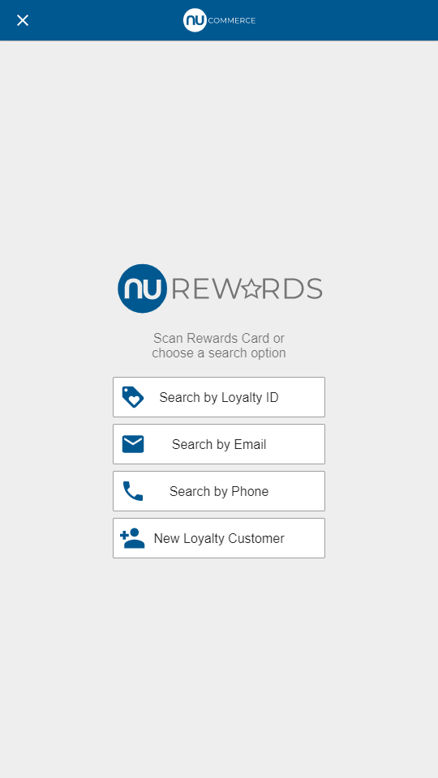

# Self Checkout Options

The self checkout options screen provides a basic list of options for the user to choose. This can be used for screens such as reciept options, loyalty search options, etc.  This is also similar to the core choose options screen.



## Setting the Image

The options screen image is set via the `icon` property on the UIMessage. This can be set from the server, for example:

``` java
screen.setIcon("content:logo");
```

## Setting the Title

The large options title is set via the `title` property on the UIMessage. This can be set from the server, for example:

``` java
screen.setPrompt("key:selfcheckout:receipt.options.title");
```

The title uses the shared `TitleComponent`. This component can be styled with scss through theming or by overriding the component.

## Setting the Instructions

The instructions text is set via the `prompt` property on the UIMessage. This can be set from the server, for example:

``` java
screen.setPrompt("key:selfcheckout:receipt.options.prompt");
```

The instructions use the shared `InstructionsComponent`. This component can be styled with scss through theming or by overriding the component.

## Options List Part

The self checkout options screen uses the shared `OptionsListComponent` for the selectable options. Styling for this component can be overriden by modifying the scss in a theme. This component can also be completely overriden with a new component by replacing the prompt `OptionsListComponent` with a new screen part.
