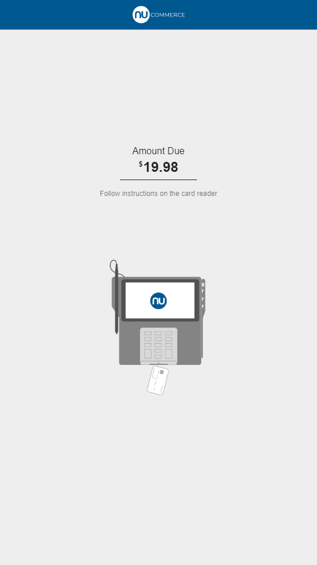

# Self Checkout Tender

The self checkout tender screen serves as the final amount tendering screen. This screen shares the same options component as self checkout options, but provides additional context related to tender amounts and partial tenders.




## Setting the Image

The tender screen image is set via the `imageUrl` property on the UIMessage. This can be set from the server, for example:

``` java
screen.setImageUrl("content:insert-card");
```

## Setting the Amount Due and Partial Tender Amounts

The amount due is set via the `amountDue` property on the UIMessage. This can be set from the server, for example:

``` java
Total amountDue = new Total("key:selfcheckout:tender.label.amountDue", currentTenderAmount.getAmount().toPlainString());
screen.setAmountDue(amountDue);
```

The partial tender amounts are set via the `amounts` property on the UIMessage. This can be set from the server, for example:

``` java
screen.addAmount(new Total(tenderTypeName, tenderAmount));
```

## Setting the Instructions

The instructions text is set via the `prompt` property on the UIMessage. This can be set from the server, for example:

``` java
screen.setPrompt("key:selfcheckout:tender.prompt.insertCard");
```

The instructions use the shared `InstructionsComponent`. This component can be styled with scss through theming or by overriding the component.

## Options List Part

The self checkout tender screen uses the shared `OptionsListComponent` for the selectable options. Styling for this component can be overriden by modifying the scss in a theme. This component can also be completely overriden with a new component by replacing the prompt `OptionsListComponent` with a new screen part.
