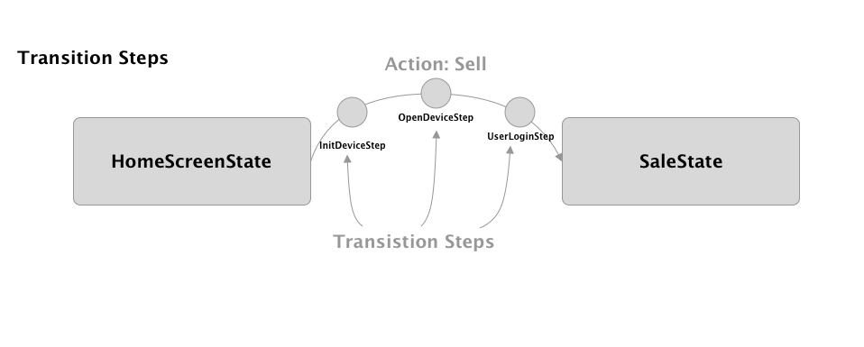
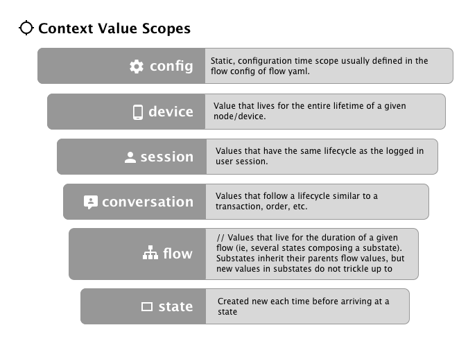
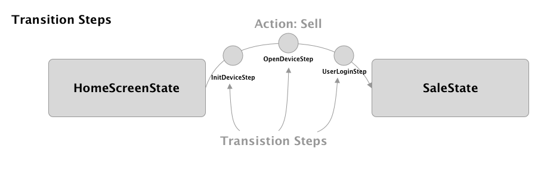

# Overview

Overall, openpos-core provides the infrastructure for defining the "flow" of a client-side retail application. It understands the steps and transitions though an application, as well as what screens to display in an abstract level.  It is **not aware** of a particular UI technology.  It says "display the sales screen with the following items" and allows the client to decide how to render that information as a screen on the UI. 

The openpos-core project contains much of what is considered the "controller" logic that resides in between the web front end client (the "view") and the business logic service code (the "model").  The core project provicdes   Specifically, core contains:

* The openpos state mahine. (The `org.jumpmind.pos.core.flow` package.)
* UIMessages such as HomeUIMessage, DialogUIMessage are abstracted screen types.
* Abstracted UI component models which make up the form screens (e.g. FormField, DateField, RadioField, etc., in the `org.jumpmind.pos.core.model` package)
* ScreenInterceptors are like filters which get run on each screen model before it is passed to the client.
* Screen templates (e.g. SellTemplate) are higher level templates for commonly used screen layouts.

# Key Classes
* **SessionSubscribedListener** - invoked by Spring when a new client connects over stomp.
* **StateManager** - dictates what the current screen of the application should be and handles actions as they come in.
* **ScreenService** - the screen service works with the MessageService to a) send screens to the client as JSON stompe messages and b) receive Actions from the client in the form of Json messages.
* **UIMessage** - represents a message (usually a screen) that is sent to the client.

# State Machine


The state machine is responsible for the "state" of a client application. 

## State machine concepts

### State: 
What state the application is in. (E.g. HomeScreenState) The state machine transitions from state to state.



A state can be represented by any java class and includes at least one method annotated with @OnArrive.

~~~~
public class HomeState {
    @OnArrive
    public void arrive(Action action) {
        showScreen();
    }
    ...
}
~~~~

States can also **inject** services, Spring beans or scoped context values.  

Services and Spring beans are typically injected using the `@Autowired` annotation.
~~~~
public class HomeState {

    @Autowired
    private IUserService userService;

    @OnArrive
    public void arrive(Action action) {
        showScreen();
    }
    ...
}
~~~~

#### Responding to Actions

Except for global actions (below) states have first dibs on handling actions.

1. Check if a Global Action Handler is configured for the action handler.  The state manager will look at the current flow and any parent flows (if the current flow is a subflow).
2. The current state 

a. Check for a specific method annotated with **@ActionHandler**.  The @ActionHandler methods follow a naming convention of onActionName, where the ActionName portion of the method name shoud match up with the action name.
```
@ActionHandler
    public void onSell(Action action) {
        if (appContext.isTransactionActive()) {
            doAction(action);
        } else {
            // other logic
        }
    }
```

b. A state can also define a special @Action called **onAnyAction**.   An action can be forwarded back to the StateManager from an action handler method.

```
    @ActionHandler
    public void onAnyAction(Action action) {
        if (appContext.isTransactionActive()) {
            // do logic    
        } else {
            doAction(action);
        }
    }
```


### Scoped Context Values (@In, @InOut, and @Out)

Scoped context values represent values which need to be **shared between states, transition steps, and action handlers.**  The currently logged in user or current transaction are common exmamples of scoped context values.

Scoped values are injected into States using the @In annotation. You can also set scoped context values using the @Out annotation. The @InOut annotation combines the 2 concepts and will both attempt to inject an existing value and also "outject" the value back into the contet  after the state runs.

~~~
public class SaleState {

    @In(scope = ScopeType.Session, required=false)
    BusinessDate businessDate;

    @InOut(scope = ScopeType.Conversation, required=false)
    private RetailTransModel currentTransaction;

    @OnArrive
    public void arrive(Action action) {
        showScreen();
    }    

}    
~~~

#### @In annotation options:
* **name** - defaults to the name of the field. In the example above, the system will look for a value named businessDate and a value named currentTransaction.
* **autoCreate** - defaults to false.  If if's true and no context value is found for the given name, then try to create and a supply a new object that matches the target type. The newly created object will then be in the contect and available for injection into other states per the scope rules.
* **required** - defaults to true, it is a pre-condition of the state the named value must exist in the context prior to arriving at this state. For example all states that assume a transaciton and operate on the currentTransaction can leave this as the default of true and assume that there will be  a non-null currentTransaction when the state runs.
* **scope** - scope defines how long a particular value will live and is useful for making sure that stale values don't bleed between flows, transactions, etc.  Each context value must be assigned to a specific scope.



### Flow Yaml Config Files

States and their transitions are represented in "flow" yaml config files.  Consider this example"

~~~~
---
DefaultFlow:
  - HomeState: 
      Sell: SaleState
      Returns: ReturnState
  - SaleState:
      Back: HomeState
  - ReturnState:
      Back: HomeState      
~~~~

This flow config has the following semantics:
* The DefaultFlow will start on the HomeState because it's the first state list.
* On the HomeState, when the "Sell" action is encountered, transtion to the SaleState.  If the "Returns" action is encountered, transition to the "ReturnState".
* When on the SaleState, if the "Back" action is encountered, transition to the HomeState.
* When on the SalReturnStateState, if the "Back" action is encountered, transition to the HomeState.

### Action

**Actions**: these are events generated either by the client or by server side state logic.  (e.g. UsernameEntered).  Actions always have a name and can have an optional payload (data) which is usually a string or a Map structure.

### TransitionStep

Steps which execute during the transition from one state to another and can show screens and cancel the transition if necessary. Transition steps are good for cross-cutting needs such as ensuring a user is logged in or the device is open, for example.



Transition steps are Spring beans which implement the ITransitionStep interface. Each TransitionStep has an **isApplication** method and **arrive** method which both receive a Transition object.  Transition steps can also use @Autowired and @In fields just like any state.

When a transition step is complete, it should call **transition.proceed()**.  If the transition needs to be canceled, then call **stransition.cancel()**.

~~~
@Component
@Order(150)
public class UserLoginStep implements ITransitionStep {

    @InOut(scope = ScopeType.Session, required = false)
    protected UserModel currentUser;

    @Override
    public boolean isApplicable(Transition transition) {
        return true;
    }

    @Override
    public void arrive(Transition transition) {
        promptForLogin();
    }
}
~~~

### Substate / Subflows

Normally, the state machine goes from state to state, with no concept of going "back" to a previous state.  All that is known (by default) is the current state and where that current state can transition to next. 

But sometimes you want to run a shared state or flow, such as customer lookup, and then **return** to the current state. That is what a subflow does: it allows for transition to a new state (or a series of states, as defined by a subflow yaml, for example) without exiting the current state.  When the subflow completes, control is returned to the state where the subflow was launched from (using a **ReturnAction**)

Here is an example which depicts a good use case for a subflow.  You are in a sale, and which to offer an item inquiry function (ie, item search, item lookup). You want the item inquriry flow to run, and then when it completes, you want the system to come back to your sale.


Details about the subflow example:
1. The user starts in the **SaleState** (i.e., a tthe selling screen of a POS.)
2. The user taps the "Item Inquiry" button which in turn fires the **ItemInquiry action**.
3. In the flow config for sale, the ItemInquiry is mapped to a subflow of **ItemInquiry** subflow.

```
SaleFlow:
  - SaleState:
      Back: CompleteState
      ItemInquiry: {subflow: ItemInquiryFlow, ReturnAction: ItemInquiryFinished}
      ...
```

A subflow does not require a seperate flow config.  You can configure a subflow to transition to single state.  For example:

```
SaleFlow:
  - SaleState:
      Back: CompleteState
      CustomerLookup: {subflow: CustomerLookupState, ReturnActions: CustomerSelected; CustomerLookupCancelled}
      ...
```

In this case, the CustomerLookup action causes the StateManager to proceed to a subflow with state CustomerLookupState. When any of the **ReturnActions** are fired (CustomerSelected or CustomerLookupCancelled), then the state machine logically treats that as a transition to the CompleteState, and will return control to the SaleState.


4. The ItemInquiry subflow has the ItemInquirySearchState as it's initial state, so the **ItemInquirySearchState** becomes the current state.

```
---
ItemInquiryFlow:
  - ItemInquirySearchState:
      Next: 
        ItemInquiryResultsState:
          Select: CompleteState
```

5. The user moves through the item inqury process by tapping Search (issuing the **Next** action) and selected an item search results (issuing the **Select** action.)
6. A subflow should always be designed to terminate by going to a special state call **CompleteState**. Once the CompleteState is reached, control will return to the calling state. The **ReturnAction** specified in the subflow invocation (in this case **ItemInquiryFinished**) will be fired at the calling state.

You can call Action.getCausedBy() on an return action to get the actual action that lead to the transition to the CompleteState in the subflow. It a context value need to get propogated up to the calling state (in this case, the selected item, for example) then it is recommended to set and retrieve that data on the action itself.  (See Action.getData().  The data coud be set to a Map to contain multiple values.)

### Globals Transitions

It is possible per flow to configure global transitions. What this means is that regardless of the current state that is active, the StateManager can handle a certain Action.  For example, mpte the "Global" secion in the following DefaultFlow config.  What that means is that if the **BackToMain** action is fired anytime during the default flow, the framework will automatically transition to the HomeScreenState.
```
DefaultFlow:
  - HomeScreenState: 
      Sell: {subflow: SaleFlow, ReturnAction: SaleFinished}
      Returns: {subflow: ReturnFlow, ReturnAction: BlindReturnFinished}

  - Global:  
      BackToMain: HomeScreenState
```
It is also possible to configure global subflows in a very similiar fashion using the **Global** identifier.

### Global Action Handlers

Similiar to a global transition, it is possible to configure a global action handler.  A global action handler works exactly like a global transition, except that it does not transition anywhere and control remains with the current state.  But this allows for the client to fire an action, and have a bit of logic respond to that action without transitioning to a different state.  

Say the application has a language dropdown on every screen. An example of a global action handler would be a piece of logic that responds to a change in the users' language.  The action handler would receive the action and the new language, change it accordingly and refresh the screen, and be done.

Global action handlers can be configured through the application properties similar to global transitions.  For example, the configuration below would map the action **LanguageChanged** to the **LanguageChangedActionHandler** class:

```
DefaultFlow:
  ...
  - Global:  
      LanguageChanged: LanguageChangedActionHandler
```

A global action handler has the same behaviour as a state (including full access to Injections through @In) except that is has a method called **@OnGlobalAction** instead of @OnArrive like a state.

```
public class LanguageChangedActionHandler  {

    @In(scope = ScopeType.Device)
    private IStateManager stateManager;    

    @OnGlobalAction
    public void handleGlobalAction(Action action) {
        // change the language here.
    }
```

