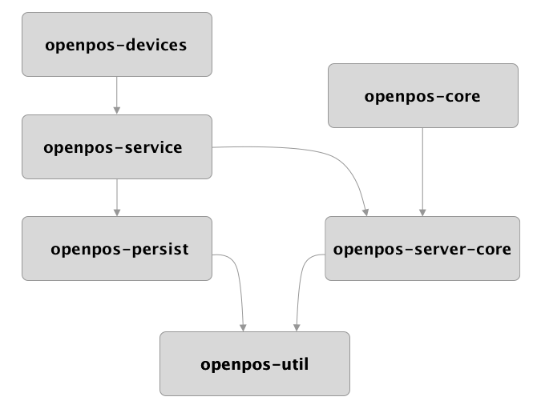

OpenPOS is a framework that was built from the ground up to build retail-based commerce applications that can run on many different platforms.

## Server Core Lib

* [Flow](openpos-flow.md)
* [Server Core](openpos-server-core.md)
* [Service](openpos-service.md)
* [Persist](openpos-persist.md)
* [Devices](openpos-devices.md)
* [Util](openpos-util.md)

## Client Core Lib
