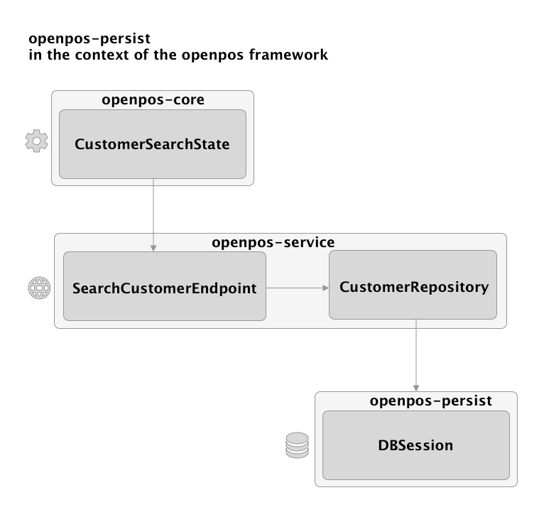
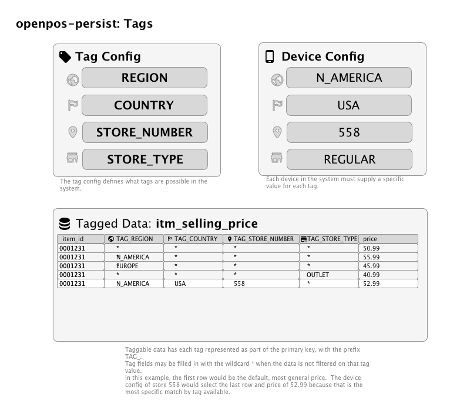

# Overview

The openpos persist framework is designed to be a simple OR/M (Object Relational mapping) framework, designed to provide convenience and consistency for persisting Java objects to a relational database, and retrieving objects back into memory.  The openpos-persist framework plays a similiar role that the Hiberate framework would play in a Java application (although openpos does not use Hiberate in any way).

openpos-persist is compatible with virtually any SQL based database that provides a complete JDBC driver.  

## Features:
* The ability to generate DDL and create a physical database schema based on Model classes.  This also includes the ability to upgrade the schema when changes are encountered.
* JDBC connection pool management.
* JDBC driver wrapper provides statement logging and logging for statements that run longer than expected.
* Persist and retrieve Model objects without any additional configuration required.
* Flexible query framework which allows for named paramters and optional parts to build more specific queries based on what parameters are provided.
* Support for "tagged" data.  Any data model can be marked with the the **@Tagged** interface which allows for a very flexible tailoring of data for different regions, stores, or devices, for example.
* Ability to run SQL scripts.

openpos-persist does not try to hide the fact that it works with a SQL based datasource, so certain API's accept SQL directly.  However, the cross-platform nature (Oracle, MSSQL, MySQL, Postgres, etc.) should always be considered when writing statements that work with openpos-persist.

# Key Classes
 * **DBSessionFactory**: there is normally one DBSessionFactory per openpos service module. DBSessionFactory knows about the database configuration for a given module, and manages the JDBC connection pool.  Mainly, DBSessionFactory **creates DBSession instances**.
 * **DBSession**: The DBSession represents live interaction with a database. Use a DBSession to save data, run queries, etc. It wraps a JDBC connection, which can be acquired with the **getConnection()** method.  Normally DBSession objects are injected directly into "Repository" classes within an openpos service module.  
 * **TableDef**: The class level annotation that defines a data model.
 * **Query**: Defines a named query and expected result type class.  Named queries can be used to retrieve eithe data models or arbitratry objects, and may or may not be mapped to more detailed configuration in a *-query.yml.

# Typical Usage Overview

This section will refer to other openpos modules and explain how openpos-persist is designed to fit in.

General Rules for using openpos-persist within complete openpos framework application:
* A State should never refer to openpos-persist.
* Each **module should define 1 DBSessionFactory** and db credentials (See subclasses of AbstractModule).  The Module class (e.g. CustomerModule) will define a "prefix" which is used to prefix tables within that module (e.g. "cust" for customer.)
* Typically, an **Endpoint implemention should also not reference DBSession** directly but rather should go through a "Repository" object.
* The **Repository** object defines higher level database retrieval and persistence and should not expose SQL details.  Think of a repository object as something that could be replaced by a non-SQL database, such as a rest service call or using a noSQL database.



## Data Model Annotations

An openpos-persist **model** is a java bean with the following attributes:

1. Extends **AbstractModel**
2. Has a class level annotation of **@TableDef**

### The TableDef annotation
The TableDef annotation declares that the given class is a data model that particpates in openpos-persist. It defines the following attributes:

* **name**: this is the base table name for the model (e.g. "customer"). When used in the context of a module, this will be prefixed with the module prefix.  So, assuming a module prefix of "cust", the final table would be cust_customer, for example.
* **description**: this is used for generating technical documentation for the data model.

### ColumnDef

ColumnDef is a field level annotation which maps a Java field to a database table field. It defines the following attributes:

* **name**: The full name of the field. This is optional; by default the camelCase name of the java field will be converted into "snake" case (words seperated by undderscores). So a field called **itemId** in the code will be represented as **item_id** in the database table.
* **primaryKey**: Each data model needs to have at least one field marked as a primary key. Adding the primaryKey=true attribute to muplitple fields will generate a composite primary key and is a common practice in the openpos framework.
* **type**: This is optional and should not normally be specified. openpos-persist will determine the JDBC type based on the Java field type. One common use for this is to specify that a **String** should map to a **clob**, as in:
type = Types.CLOB
~~~
    @ColumnDef(type = Types.CLOB,description="The Config value formatted in JSON format")
    String configValue;
~~~
* **size** This is optional and should not normally be specified.  String types will default to VARCHAR(128) and BigDecimal types will default to decimal(12,3).
* **required** defaults to false, unless the field is a primary key field. If true, the schema generated will have this as a non-nullable field.
* **defaultValue** if specified, generates a schema with the given default value for the field.
* **autoIncrement** default to false, setting to true will instruct the database schema to create this field as a database auto incrementing field.  **Use with caution:** Often simple auto-incrementing fields do you work well with synchronized, distributed databases, where there could be collisions in the auto-incrementing values.
* **description**: this is used for generating technical documentation for the data model.
* **crossReference**: This is used in mapping special types which require knowledge of other field values in order to assemble the final value. This is used to map the **Money** type. The Money type is composed of two values: the decimal value of the amount, as well as a VARCHAR type for the currency code.  A typical use of crossReference is to map a Money field to its corresponding currency code.  For example: 

~~~
    @ColumnDef(crossReference="isoCurrencyCode", 
            required=true,description="The price")
    Money price;

    @ColumnDef
    String isoCurrencyCode;    
~~~

### IndexDef

This is an optional, field-level annotation used to define database indexes for lookup performance.  When the IndexDef is applied to multiple fields with the same index **name** then that index will include all the fields.  It is possible to **order** the fields within the index using the ***order** attribute.

### Tagged

Marks the given data model as "tagged" which will add the configured tagged elements (e.g. Brand, Region, Store, etc.) to the model and use those tagged elements to filter results.  See Tagging System below.

* **includeTagsInPrimaryKey**: defaluts to true, and makes the tag values part of the primary key. This should be set to false in the case that you need data to be uniquely identifiable across your tags (e.g. a Device may have a unique device ID which spans brand, region, etc.)

### Control Fields
Every table in openpos should have the following control fields/meta fields, which are extremely valuable in auditing data sync and distrbution issues.
* **create_time**: when the row was originally created in openpos. This field should not be modified by synchroniztion
* **update_time**: when the row was last modified by the retail application.  Initially, this value should be the same as the create_time.  When an update is later applied, then this update_time should be modified. Using a database standard function such as CURRENT_TIMESTAMP is encouraged for this function.
* **create_user**: ideally this is set to the application user instead of just the database user if possible.  
* **update_user**: initially the same value as the create_user.  If an application user later update a row, than the update_user should reflect the user who modified the row.

## Inserting and Updating Data

Data is typically inserted or updated by **DBSession.save(model)**.  Note that openpos-persist does not currently provide automatic support for relationships, so it is the developer's responsibility to save the child components of a data model to the database in a transation. 

**Database transactionality** is currently delegated to Spring and not made explicit by openpos-persist.  Specfically, when you need to make transactional calls to DBSession.save(), they should me made from a Spring managed context marked with the Spring **@Transactional** annotation.

Example of decomposing and persisted elements of a transaction object graph:
~~~
    public void save(TransModel transaction) {
        
        dbSession.save(transaction);

        if (transaction instanceof RetailTransModel) {
            RetailTransModel saleTransaction = (RetailTransModel) transaction;
            List<RetailLineItemModel> lineItems = saleTransaction.getRetailLineItems();
            for (RetailLineItemModel lineItem : lineItems) {
                dbSession.save(lineItem);
                ....
~~~

## Retrieving data

Data can be retrieved in several ways:

* By Type, ID, or By an example object.  DBSession search methods that start with **find** allow for structured lookups where you have a data model and certain defined fields to search by.
* By Query: For a very flexible means of querying the database, is this methods of the **query** class can be used.   Queries are named and defined in a query.yml file.  Typically each module has at least 1 yaml file.

## Query details

A query in openpos persist consists of a query definition in in a query.yml file plus a named query declaration in the code.  

Consider the following example of **searchCustomer**:

From cust-query.yml
~~~
---
queries:
-
  name: searchCustomer
  select: 
      select distinct c.customer_id from cust_customer c 
        join cust_group_link l on c.customer_id=l.customer_id
  where:
     l.customer_group_id = ${customerGroupId}
  optionalWhereClauses: 
    - c.loyalty_number = ${loyaltyNumber}
    - c.last_name = ${lastName}
    - c.first_name = ${firstName}
    - c.other_identification = ${otherIdentification}
~~~

Then the correponding Java code (in the CustomerRepository):
~~~
Query<String> searchCustomerQuery = new Query<String>().named("searchCustomer").result(String.class).useAnd(criteria.isUseAnd());

List<String> customerIds = dbSession.query(searchCustomerQuery, criteria.getCriteria());
~~~

Parts of a query definition:

* **name**: The name of the query.  Used by the code to reference the query.
* **select**: The select portion of the query.  If you are querying and your result class is a data model (with @TableDef) then you can omit the select portion of the query. 
* **where**: the main, required where clause.  Any named paramters in this portion are considered to be required and an exception will be thrown if not all paramters are provided (in the example above, an exception would be thrown if customerGropuId were not provided)
* **optionalWhereClauses**: These are where clauses that are only added to the final query statement if the named paramters they reference are present.  By default, optionalWhereClauses are added on to the statement as a OR clause.  So for the example above, if the loyaltyNumber parameter is provided when running the query, then the framework will add " OR c.loyalty_number = ?' to the generated query.
* **orderBy**: It's also possible to add an order by clause which will be appended after all the where clauses.  E.g.:

```orderBy: model_year, make, model```

* **groupBy**: A groupBy element can be specified in order to support aggregate queries.

It's also possible to define a query that specifies arbitrary SQL, as in:
~~~
-
  name: carCountByModel
  select: > 
    select count(*) as count, model 
    from car_car 
    where make = ${make} 
    group by model 
    order by model
~~~

The framework will always try hard to match up query result fields with fields on the result class specified in code.  **A result class does not have to be a data model class** but can be any java bean typep class. In the carCountByModel, "count" and "model" could be matched up with a simple result class like:

~~~
public class CarStats {
    private int count;
    private String model;
    ...
}
~~~

To invoke a query, you will need a Query object in code.  These can either be statically created and shared, or created locally in a given method.  

~~~
Query<CarStats> modelCounts = new Query<CarStats>()
        .named("carCountByModel")
        .result(CarStats.class);

List<CarStats> carStats = db.query(modelCounts, "Hyundai");
~~~

In the preceeding example: 
* The result class is specified a **CarStats.class**.  A result class could be a data model or any arbitrary java bean.
* **named**: Defines the query name which will match up with a query name in from a *-query.yml.
* **useAnd**: default to false. This determines how the framwork logically combintes the optional where clauses.  The default is to use OR (useAnd=false), but if useAnd(true) is added to the query declaring, then the where clauses will be combined using the AND operator.  This setting does not affected the internals of any of the SQL components at all, but only how certain clauses are combined.

## Tagging System

Often, an enterprise retail system has the need to segment data different ways.  Some may want to segement by brand, some may want to segment by geogrphical location, or both. Some may need to segement data by store type (regular vs. outlet, or store vs. warehouse).  

In an effort to be completely flexible and robust for these requirements, openpos-persist suppose the notion of **tagging** data.  

The set of tags to be used by a system are defined through configurion.  Tags should be planned out as much as possible and not changed on the fly, as often changing tags will effect the data model and primary keys.  A user of DBSessionFactory must supply a TagHelper instance, which has a reference to a TagConfig.  Example tag configuration:

~~~
  tagconfig:
    tags:
    -
      name: REGION
      group: LOCATION
      level: 1
    -
      name: COUNTRY
      group: LOCATION
      level: 2
    -
      name: STATE
      group: LOCATION
      level: 3
    -
      name: STORE_NUMBER
      group: LOCATION
      level: 4
    -
      name: STORE_TYPE
    -
      name: DEVICE_TYPE
      size: 20
    -
      name: PRICE_ZONE
      size: 20
    -
      name: APP_PROFILE
~~~

Each tag element has the following attributes:
* name: the name of the tag. Upper-case, underscore seperated is encouraged for this name. These names will be used for database fields.
* group: more than one tag can be grouped together to indicate a a relationship beween the tags.
* level: related to a group: a tag can be given a level.  In the example above, we are defining the store hierarchy structure through tags. Regions have countries.   Countries have states, and finally states have store numbers.
* size: size reference to the database column size. VARCHAR fields typically default to 128 characters in openpos-persist, but that could lead to a primary key that is too wide. So it makes sense if you know some of the tag code values will not be longer then 20 or 30 characters, to specify the length in the tag configuration.




