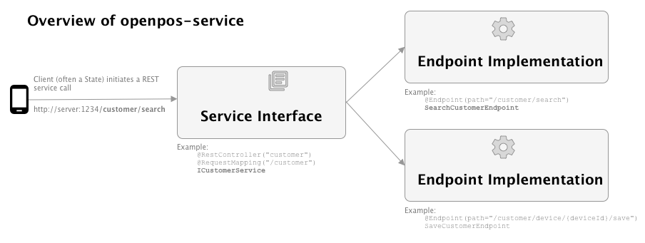

# Overview

openpos-service is a key part of the openpos framework. openpos-service defines **Modules** which contain the business logic of the application. Each module defines one or more Rest service, which in turn defines one or more **Endpoint**. The Endpoint is the key building block of an openpos module.

Service invocations are "standard" JSON **rest services** and can be thought of as pretty much like a Spring @RestController, with some additional routing in place. So instead of one single class handling all the web methods for a particular service, openpos-service routes and delegates each web service method it's own class for processing.

The services are designed to be stateless, so any required context  should be passed in on each service method invocation.

These are the main components of an openpos-service:

* A **module** is defined.  A module is usually a java project with a dependency on at least openpos-service. (e.g. CustomerModule)
* A module contains one or more Rest **Service Interfaces**.  The Service Interface is a Java interface which defines the possible Rest URL patterns handled, and maps them to Java method contracts. (ICustomerService)
* There should be one **endpoint implementation** provide for each method declared in the Service Interface.  The Endpoint implementation provides the concrete logic for each service method. (SearchCustomerEndpoint)

The high level logic of openpos-service is this:
* The Spring rest controller receives the rest request and forwards it to a (generated) implementation of the Service Interface (e.g. ICustomerService)
* The EndpointDispatchInvocationHandler forwards the rest service request to the correct @Endpoint implementation (e.g. SearchCustomerEndpoint)
* The endpoint receives the request and repsonds to it and Spring translates that result back into JDON for the REST response.

# Key Classes

* **AbstractModule**: base class for all Module declaration classes.  The Module declaration defines things like the module name, version, table prefix, and local SQL datasource.
* **@Endpoint**: Annotation that marks a class as an endpoint.  An endpoint implements one service method (e.g. "searchCustomer") as part of a larger rest service.

# Modules

## How to add a new module

Each module should be a seperate Java project which depends on openpos-service.

A module starts with the module declration class, which is a subclass of AbstractModule.  Spring is used to discover and configure the module declarations.

~~~
@Configuration("CustomerModule")
@EnableTransactionManagement
@Conditional(ModuleEnabledCondition.class)
@Order(10)
public class CustomerModule extends AbstractModule {
~~~
The module declaration provides at least the following information about the module:
* name: a short, technical name for the module.
* version: a 3 part version of major.minor.fix.
* table prefix: usually a 3-4 character short prefix.  This should be roman letters (a-z) only as it used to contruct database table names.
* txManager, securityService, dataSource, sessionFactory, session: These methods are usually boilerplate and just make sure that Spring creates distinct objects, named for the module, for method.  For example:
~~~
    @Override
    @Bean(name = NAME + "DataSource")
    protected DataSource dataSource() {
        return super.dataSource();
    }

    @Override
    @Bean(name = NAME + "SessionFactory")
    protected DBSessionFactory sessionFactory() {
        return super.sessionFactory();
    }

    @Override
    @Bean(name = NAME + "Session")
    protected DBSession session() {
        return super.session();
    }
~~~
* **Rest Service bean**: Finnaly, the Module declaration class should also provide methods which create any rest service bean.  The rest service bean always starts with the Service Interface (which is an Annotated Java Interface).
~~~
    @Bean
    protected ICustomerService customerService() {
        return buildService(ICustomerService.class);
    }
~~~

* The Service Interface is backed by one or more **@Endpoint implementations**. In this example, the Service Interface of ICustomerService looks like this:

~~~
@Api(tags = "Customer Service", description = "This service exposes endpoints to retrieve customer information")
@RestController("customer")
@RequestMapping("/customer")
public interface ICustomerService {

    @Sample
    @RequestMapping(path="/search", method=RequestMethod.POST)
    @ResponseBody
    public SearchCustomerResult searchCustomer(@RequestBody SearchCustomerRequest request);
    
    @Sample
    @RequestMapping(value="/device/{deviceId}/save", method=RequestMethod.POST)
    public CustomerModel saveCustomer(@PathVariable("deviceId") String deviceId, @RequestBody CustomerModel customer);
}
~~~

Description of the annotations:
* @Api (Swagger) is used by swagger to generate documentation and a Rest service test page.
* @RestController (Spring) makes this a Spring bean.
* @RequestMapping (Spring) maps all method in this Service Interface under the URL path of "/customer"
* @Sample (openpos_ means that you want this web method to be sampled and for the framework to collect statistics about how it is invokved.
* @RequestMapping (Spring) is the standard Spring annotation to map a method to a more specific part of the REST URL and to an HTTP method.
* @ResponseBody (Spring) indicates that the method return value should be mapped to the web response body (in this case, as JSON)

This example has two methods, **searchCustomer** and **saveCustomer**.  So it will require two **@Endpoint** implementations.
~~~
@Endpoint(path="/customer/search")
@Transactional(transactionManager=CustomerModule.NAME + "TxManager")
public class SearchCustomerEndpoint {

    @Autowired
    private CustomerRepository customerRepository;
    
    public SearchCustomerResult searchCustomer(SearchCustomerRequest request) {
        return new SearchCustomerResult(customerRepository.search(request.getCriteria()));
    }
}
~~~
And:
~~~
@Endpoint(path="/customer/device/{deviceId}/save")
@Transactional(transactionManager = CustomerModule.NAME + "TxManager")
public class SaveCustomerEndpoint {

    @Autowired
    CustomerRepository customerRepository;

    @Autowired
    IContextService contextService;

    public CustomerModel saveCustomer(String deviceId, CustomerModel customer) {
        // details ommitted
        customerRepository.save(customer);   
        return customer;
    }
~~~

Notes on Endpoint implemetations:
* The name of the Endpoint class should also be the method name + Endpoint.  So in the case of the **"searchCustomer"** method, we have a **SearchCustomerEndpoint**.  This is a convention and not technically used by the framework.
* Endpoints are discovered by declaring the **@Endpoint** annotation.  They are matched up and selected based on the **path** in the Endpoint annotation.  So in the example above, the Endpoint paths are a concatentation of the @RestController path and the @RequestMapping path.

## How to add a new service method

For an existing module, there are just two steps for adding a new service method.

1) Declare the new **service method** on your service interface, with the proper Rest mappings. E.g. maybe we want to add a "forgetCustomer" service for a customer who wishes for their personal data to be removed from the system.  In ICustomerService, we would add a method declaration:
~~~
@RequestMapping(value="/device/{deviceId}/forget", method=RequestMethod.POST)
    public CustomerModel forgetCustomer(@PathVariable("deviceId") String deviceId, @RequestBody CustomerModel customer);
~~~

2. Then, in the customer-module, add a new **@Endpoint implementation** for the service method.  Since the method is called "forgetCustomer", the new @Endpoint should be called ForgetCustomerEndpoint.

~~~
@Endpoint(path="/customer/forget")
@Transactional(transactionManager=CustomerModule.NAME + "TxManager")
public class ForgetCustomerEndpoint {

    @Autowired
    private CustomerRepository customerRepository;
    
    public ForgetCustomerResult forgetCustomer(SearchCustomerRequest request) {
        // implementation here
    }
}
~~~

## Repositories and Persistence

Normally a module will declare a DBSessionFactory and DBSession in its module declaration class. This makes it natural to write one or more **repository** classes. Any logic that saves or retries data should be placed in a repository class.  The repository class should expose a clean API to the service which does not suggest what persistence technology it is using to save or retrive the data.

### CustomerRepository Example
~~~
@Repository
public class CustomerRepository {

    @Autowired
    @Qualifier(CustomerModule.NAME + "Session")
    @Lazy
    private DBSession dbSession;

    public List<CustomerModel> search(SearchCriteria criteria) {
        String sqlName = "searchCustomer";
        if (criteria.contains("phoneNumber")) {
            sqlName = "searchCustomerByPhone";
        } else if (criteria.contains("email")) {
            sqlName = "searchCustomerByEmail";
        } else if (criteria.contains("zip")) {
            sqlName = "searchCustomerByZip";
        }
        Query<String> searchCustomerQuery = new Query<String>().named(sqlName).result(String.class).useAnd(criteria.isUseAnd());
        List<String> customerIds = dbSession.query(searchCustomerQuery, criteria.getCriteria());
        List<CustomerModel> customers = new ArrayList<>();
        for (String customerId : customerIds) {
            CustomerModel model = find(customerId);
            customers.add(model);
        }
        return customers;
    }
    ...
~~~

In this example, the CustomerRepository is a normal Spring bean, annotated with @Repository.  The DBSession here comes from openpos-persist, and provides the openpos framework's view of an open relational database connection.  

For details on DBSession, Query, etc. see the documentation on openpos-persist.

## Endpoint Override and Customization

Endpoints can be overriden on a case by case basis. Say you are working on a client implementation and you want to enhance customerSearch to also display the customer's favorite food, which is obtained from a 3rd party web service.

Overriding an Endpoint is pretty simple. Instead of annotating with @Endpoint, use **@EndpointOverride**  instead.  The **path** needs to match exactly with the Endpoint you want to override.

~~~
@EndpointOverride(path = "/customer/search")
public class SearchCustomerEndpointOverride {

    public SearchCustomerResult searchCustomer(SearchCustomerRequest request) {
        // call web service call to get customer's favorite food.
        // ....
    }
}
~~~

Oftentimes, like in this example, you will want to augment the existing Endpoint and not completely replace it.  We are recomending you **avoid Java inheritence** in the Endpoint overrides. Instead, you can use composition to cleanly refer to the base Endpoint.  Here is an example where the **base Endpoint is injected, invoked, and it's response can then be augmented by the override**:

~~~
@EndpointOverride(path = "/customer/search")
public class SearchCustomerEndpointOverride {

    @Autowired
    private SearchCustomerEndpoint searchCustomerEndpoint;

    public SearchCustomerResult searchCustomer(SearchCustomerRequest request) {
        // call web service call to get customer's favorite food.
        SearchCustomerResult result = searchCustomerEndpoint.searchCustomer(request);
        // combine search results with the web service call data.

    }
}
~~~

So here the key is to @Autowire in the base Endpoint, instead of intertwining the two Endpoint implementations through inheritence.

## Local vs. Remote Service Calls

Each service method can be configured to make a local or remote call. For example, when looking up an item, maybe you really just want the server to chec the store database.  But when looking up a customer (who may have signed up at a different store), you will also want to check the central office server.

Whether a service or method is local or remote is determined by the presence of EndpointSpecificConfig.  A mapping is typically built up in the Spring loaded application.yml file, similiar to this:

~~~
  services:
    commonConfig:
      remote:
         httpTimeout: 30
         url: 'http://localhost:6142' 
    specificConfig:
      pay:
        strategy: LOCAL_ONLY
        implementation: simulated
      admin:
        profile: remote
        strategy: REMOTE_ONLY
      item:
        profile: local
      customer:
        profile: remote
        strategy: REMOTE_FIRST      
      returnsmgmt:
        profile: remote
        strategy: REMOTE_FIRST
~~~

